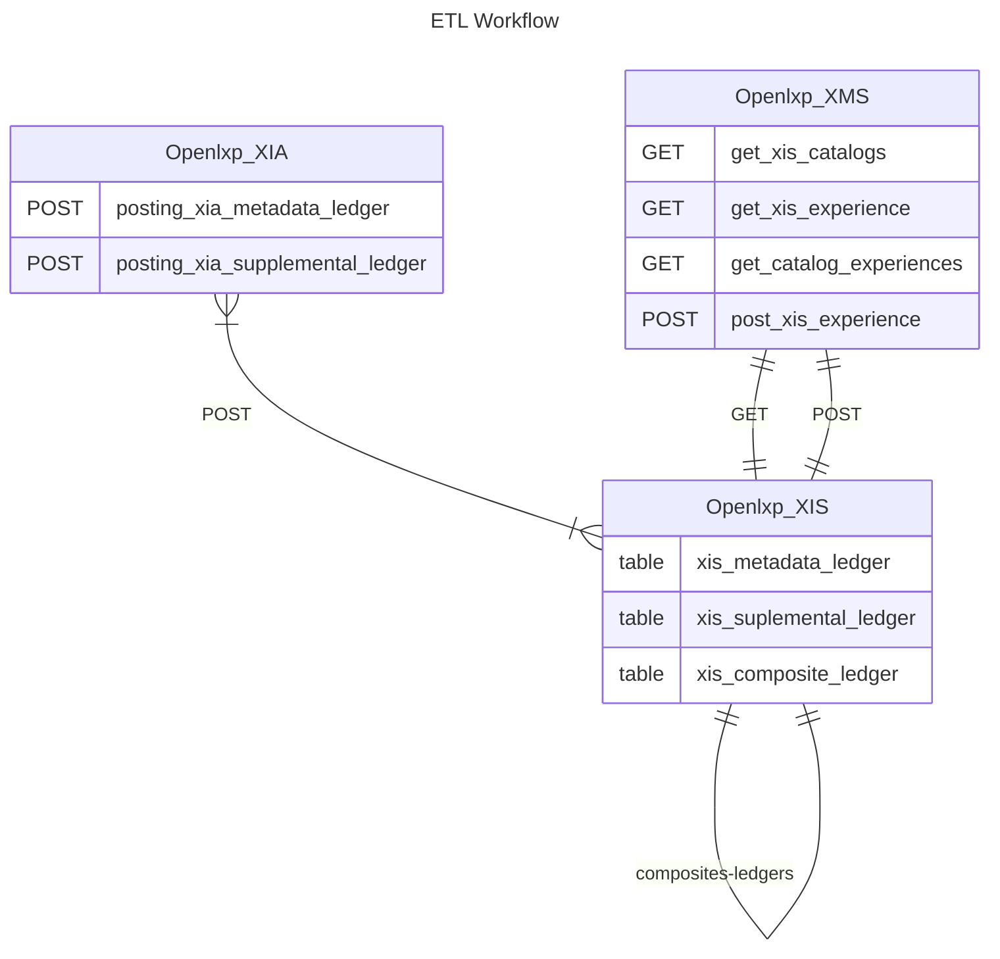
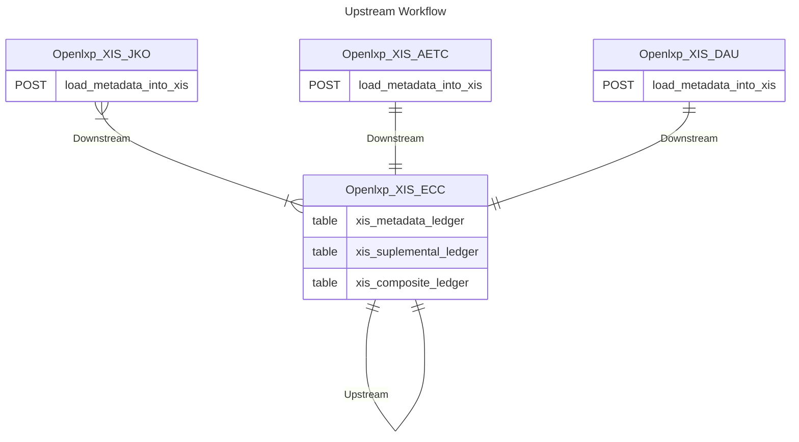
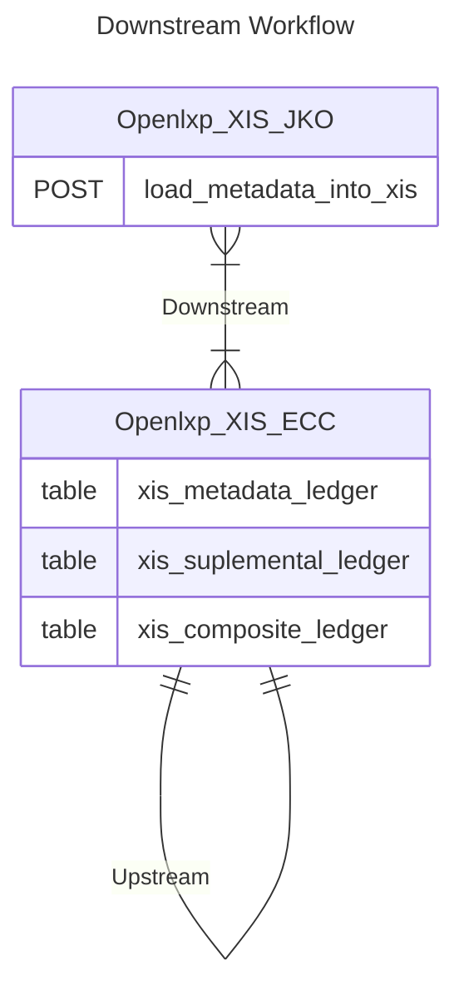

# Workflows

XIS has 3 workflows that can be run. Consolidation and loading of Metadata and Supplemental Metadata into Compositing Ledger then loading it into XSE. Additionally the XIS supports XIS Upstream and XIS Downstream Syndication.

 

## ETL (xis-workflow)

The ETL (Extract, Transform, Load) workflow takes processed metadata from Experience Index Agents (XIA) and supplemental metadata from Experience Management Service (XMS), validates and loads it into Experience Index Service's (XIS) metadata and supplemental ledgers respectively. The combination of these data sources is merged into XIS's composite ledger after passing through a validation process. The resulting composite metadata is then forwarded to an Experience Search Engine (XSE) for further data discovery.

### Workflow Diagram

### Triggering the ETL (xis-workflow)

|Can Be Triggered By | Description |
 |----------------|----------------------------------|
 |**API Endpoint:** localhost:8080/api/xis-workflow | Visiting this api endpoint triggers the ETL xis-workflow |
 |**Celery Beat:** localhost:8080/admin | On the admin page add periodic task and a schedule. Select the workflow to run from the Task (registered) dropdown list.      On the selected time interval celery task will run the task.|

 

## Upstream Syndication (upstream-workflow)

Upstream Syndication establishes a connection from the current XIS to another XIS to retrieve experiences. Upon execution, it triggers a task that iterates over all active XIS Upstream configurations. This task fetches all experiences from the remote XIS's Composite Ledger and tries to load them into the local XIS's Metadata and Supplemental Ledgers. Any data that doesn't adhere to the local schema or fails the upload process is discarded, ensuring data consistency and integrity.

### Workflow Diagram

### Triggering Upstream Syndication (upstream-workflow)

|Can Be Triggered By | Description |
 |----------------|----------------------------------|
 |**API Endpoint:** localhost:8080/api/upstream-workflow | Visiting this api endpoint triggers the upstream-workflow |
 |**Celery Beat:** localhost:8080/admin | On the admin page add periodic task and a schedule. Select the workflow to run from the Task (registered) dropdown list.      On the selected time interval celery task will run the task.|

 

## Downstream Syndication (downstream-workflow)
Downstream Syndication enables the current XIS to connect to another XIS for sending experiences. The workflow activation triggers a task iterating over all active XIS Downstream configurations. This task pulls all experiences from the local XIS's Composite Ledger, applies necessary filters to the records and metadata, and attempts to load them into the remote XIS's Metadata and Supplemental Ledgers using the managed-data API. Any data not matching the remote schema or failing the upload validation is not saved, preserving data compliance and quality.

### Workflow Diagram

### Triggering Downstream Syndication (downstream-workflow)

|Can Be Triggered By | Description |
 |----------------|----------------------------------|
 |**API Endpoint:** localhost:8080/api/downstream-workflow | Visiting this api endpoint triggers the downstream-workflow |
 |**Celery Beat:** localhost:8080/admin | On the admin page add periodic task and a schedule. Select the workflow to run from the Task (registered) dropdown list.      On the selected time interval celery task will run the task.|